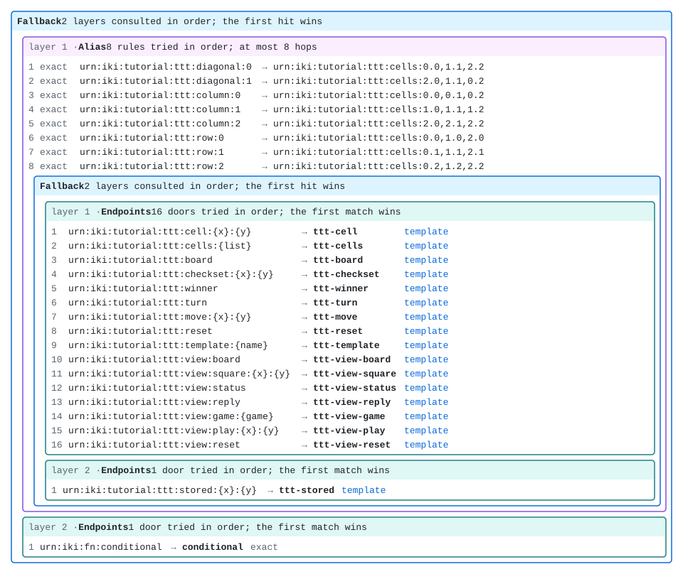

# Tic-tac-toe, VII: the game's space is a file

Six parts built tic-tac-toe as resources. The atom is code, because it holds the marks, and
the rules and views are small functions and templates. But one thing about the game was still
Rust in every part: its *arrangement*. Which doors exist, in what order they are tried, which
names are only other names (the eight lines of Part II), and what a host puts beside the game
(`conditional`, for the views) were all calls in `space_with_store` and `kernel_over`.

A kernel already reports its arrangement. `urn:kernel:topology` answers it as Turtle, and the
catalog and the [tracing](../beyond/tracing.md) chapter read it. This part runs that the
other way: the arrangement is written down as data, one file, and the kernel builds the game
from it. The endpoints stay in Rust. Everything around them moves into the file.

## The file

Here is the game's whole arrangement, `crates/tic-tac-toe/tic-tac-toe.arrangement`:

```text
{{#include ../../../../crates/tic-tac-toe/tic-tac-toe.arrangement}}
```

It is an s-expression, read by `ikigai-sexpr`, which converts it losslessly to and from the
Turtle that core builds a space from. Read it from the outside in:

- **`(fallback A B)`** is an ordered list of spaces. A name is tried in the first, then the
  second, and the first one that answers wins. The game is first. The second layer holds the
  one thing the views use that the game does not bind, `ikigai-fn`'s `conditional`, which
  `kernel_over` added in code.
- **`(alias rules… space)`** is Part II's table. Each `exact` rule renames one name to
  another before the space inside sees it, so `urn:iki:tutorial:ttt:row:0` reaches the line
  of cells it holds. The rules are the whole of Part II's `LINES`, and no code is behind them.
- **The inner `fallback`** is Part IV's seam: every composite first, then the store, in a
  space of its own. That is what lets a game corridor, or a store in another process, answer
  for the stored cell alone.
- **`(endpoints (door pattern endpoint) …)`** is an endpoint space. Each door binds a
  pattern to an endpoint, *by the endpoint's name*, and the doors are tried in the order
  written.

Eight doors say `:match template`. A door's pattern is text, and text alone cannot say how it
matches: `urn:iki:tutorial:ttt:board` could be one exact name, or a URI template that happens
to have no variables. Both match the same single name. The reader takes a pattern with no
braces as exact, but the game's Rust binds every door through `UriTemplate::parse`, so those
eight are templates, and the file says so to declare the arrangement the code builds. Left
out, the game would answer the same, but it would be a different arrangement. This part
checks that it is the same one, so the file says it.

## What stays Rust: the endpoints, in a registry

A declaration binds a door to an endpoint by name, and never makes one. So the host's half
is a registry: every endpoint the game has, each under the name it gives itself.

```rust,ignore
{{#include ../../../../crates/tic-tac-toe/src/declared.rs:registry}}
```

Eighteen endpoints, each the same function earlier parts wrote: the atom, the cell, the line,
the board, the rules, the templates, the views, the two view writes, and `conditional`. None
of them changed to be declared.

The five views need one thing here. Each is `composeOver` bound to a different template, and
an unnamed `composeOver` answers the name `composeOver`. A registry holds one endpoint per
name, because a door that said "`composeOver`" could otherwise mean any of the five:

```rust,ignore
{{#include ../../../../crates/tic-tac-toe/tests/declared.rs:refusals}}
```

So the registry names each view (`ttt-view-board`, and so on) where it registers it. Part V's
`view` is unchanged, and so is the coded game, whose views are still unnamed.

Three endpoints are configured with a value rather than just registered. The CheckSet, the
winner and the reset read the line table, to know which lines pass through a cell and which
squares a reset clears. In the coded game that table is `LINES`. In the declared game it comes
from the file, so the board's geometry is written once:

```rust,ignore
{{#include ../../../../crates/tic-tac-toe/src/declared.rs:build_game}}
```

`lines_of` finds the file's one alias and turns its rules into a table. Everything else is
core's `build`: it walks the declaration, rebuilds each space with its public constructor,
binds each door to the registered endpoint of that name, and hands back a live space. A host
for the declared game is then one line:

```rust,ignore
{{#include ../../../../crates/tic-tac-toe/src/declared.rs:declared_kernel}}
```

## The round trip

A declaration is also a resource. The file is bound at
`urn:iki:tutorial:ttt:arrangement:tic-tac-toe`, and `urn:iki:tutorial:ttt:build` reads the
declaration it is given through the kernel, builds it against the game's registry, and
answers what it built, printed back as an arrangement:

```rust,ignore
{{#include ../../../../crates/tic-tac-toe/src/declared.rs:build_endpoint}}
```

The file is served as `text/x-ikigai-arrangement`, and nothing in the build endpoint parses
that. It asks the kernel for a transreption to `text/turtle`, and the kernel finds
`ikigai-sexpr`'s. Run it:

<div class="ikigai-run" data-cmd='source urn:iki:tutorial:ttt:build urn:iki:tutorial:ttt:arrangement:tic-tac-toe
source urn:iki:tutorial:ttt:build urn:iki:tutorial:ttt:arrangement:tic-tac-toe'>
<pre class="ikigai-run-expected">(fallback
  (alias
    (exact "urn:iki:tutorial:ttt:diagonal:0" "urn:iki:tutorial:ttt:cells:0.0,1.1,2.2")
    (exact "urn:iki:tutorial:ttt:diagonal:1" "urn:iki:tutorial:ttt:cells:2.0,1.1,0.2")
    (exact "urn:iki:tutorial:ttt:column:0" "urn:iki:tutorial:ttt:cells:0.0,0.1,0.2")
    (exact "urn:iki:tutorial:ttt:column:1" "urn:iki:tutorial:ttt:cells:1.0,1.1,1.2")
    (exact "urn:iki:tutorial:ttt:column:2" "urn:iki:tutorial:ttt:cells:2.0,2.1,2.2")
    (exact "urn:iki:tutorial:ttt:row:0" "urn:iki:tutorial:ttt:cells:0.0,1.0,2.0")
    (exact "urn:iki:tutorial:ttt:row:1" "urn:iki:tutorial:ttt:cells:0.1,1.1,2.1")
    (exact "urn:iki:tutorial:ttt:row:2" "urn:iki:tutorial:ttt:cells:0.2,1.2,2.2")
    (fallback
      (endpoints
        (door "urn:iki:tutorial:ttt:cell:{x}:{y}" ttt-cell)
        (door "urn:iki:tutorial:ttt:cells:{list}" ttt-cells)
        (door "urn:iki:tutorial:ttt:board" ttt-board :match template)
        (door "urn:iki:tutorial:ttt:checkset:{x}:{y}" ttt-checkset)
        (door "urn:iki:tutorial:ttt:winner" ttt-winner :match template)
        (door "urn:iki:tutorial:ttt:turn" ttt-turn :match template)
        (door "urn:iki:tutorial:ttt:move:{x}:{y}" ttt-move)
        (door "urn:iki:tutorial:ttt:reset" ttt-reset :match template)
        (door "urn:iki:tutorial:ttt:template:{name}" ttt-template)
        (door "urn:iki:tutorial:ttt:view:board" ttt-view-board :match template)
        (door "urn:iki:tutorial:ttt:view:square:{x}:{y}" ttt-view-square)
        (door "urn:iki:tutorial:ttt:view:status" ttt-view-status :match template)
        (door "urn:iki:tutorial:ttt:view:reply" ttt-view-reply :match template)
        (door "urn:iki:tutorial:ttt:view:game:{game}" ttt-view-game)
        (door "urn:iki:tutorial:ttt:view:play:{x}:{y}" ttt-view-play)
        (door "urn:iki:tutorial:ttt:view:reset" ttt-view-reset :match template))
      (endpoints
        (door "urn:iki:tutorial:ttt:stored:{x}:{y}" ttt-stored))))
  (endpoints
    (door "urn:iki:fn:conditional" conditional)))
[computed]
(fallback
  (alias
    (exact "urn:iki:tutorial:ttt:diagonal:0" "urn:iki:tutorial:ttt:cells:0.0,1.1,2.2")
    (exact "urn:iki:tutorial:ttt:diagonal:1" "urn:iki:tutorial:ttt:cells:2.0,1.1,0.2")
    (exact "urn:iki:tutorial:ttt:column:0" "urn:iki:tutorial:ttt:cells:0.0,0.1,0.2")
    (exact "urn:iki:tutorial:ttt:column:1" "urn:iki:tutorial:ttt:cells:1.0,1.1,1.2")
    (exact "urn:iki:tutorial:ttt:column:2" "urn:iki:tutorial:ttt:cells:2.0,2.1,2.2")
    (exact "urn:iki:tutorial:ttt:row:0" "urn:iki:tutorial:ttt:cells:0.0,1.0,2.0")
    (exact "urn:iki:tutorial:ttt:row:1" "urn:iki:tutorial:ttt:cells:0.1,1.1,2.1")
    (exact "urn:iki:tutorial:ttt:row:2" "urn:iki:tutorial:ttt:cells:0.2,1.2,2.2")
    (fallback
      (endpoints
        (door "urn:iki:tutorial:ttt:cell:{x}:{y}" ttt-cell)
        (door "urn:iki:tutorial:ttt:cells:{list}" ttt-cells)
        (door "urn:iki:tutorial:ttt:board" ttt-board :match template)
        (door "urn:iki:tutorial:ttt:checkset:{x}:{y}" ttt-checkset)
        (door "urn:iki:tutorial:ttt:winner" ttt-winner :match template)
        (door "urn:iki:tutorial:ttt:turn" ttt-turn :match template)
        (door "urn:iki:tutorial:ttt:move:{x}:{y}" ttt-move)
        (door "urn:iki:tutorial:ttt:reset" ttt-reset :match template)
        (door "urn:iki:tutorial:ttt:template:{name}" ttt-template)
        (door "urn:iki:tutorial:ttt:view:board" ttt-view-board :match template)
        (door "urn:iki:tutorial:ttt:view:square:{x}:{y}" ttt-view-square)
        (door "urn:iki:tutorial:ttt:view:status" ttt-view-status :match template)
        (door "urn:iki:tutorial:ttt:view:reply" ttt-view-reply :match template)
        (door "urn:iki:tutorial:ttt:view:game:{game}" ttt-view-game)
        (door "urn:iki:tutorial:ttt:view:play:{x}:{y}" ttt-view-play)
        (door "urn:iki:tutorial:ttt:view:reset" ttt-view-reset :match template))
      (endpoints
        (door "urn:iki:tutorial:ttt:stored:{x}:{y}" ttt-stored))))
  (endpoints
    (door "urn:iki:fn:conditional" conditional)))
[cached]</pre>
</div>

That answer is the built space describing itself, not the file echoed back. The comments are
gone, because a space has none to report. The eight rules come out diagonals first, in the
order the alias table tries them (longest name first), not the order the file lists them in.
Everything else is the file. Building it and asking the result for its arrangement gives the
arrangement you started with: the round trip is a fixpoint, and a test holds it to that.

The second line was served from the cache. The build is a pure function of what it read, so
it hangs from the file's golden thread, and a change to the file would rebuild it.

### The same game, twice

The page's kernel now holds both games: the coded one, which every earlier part played, and
one built from the file. A cell that says `data-game='a'` plays the coded game `a`, as in
Part IV. A cell marked as a *declared* game `a` runs in a corridor that holds the whole game
built from the file, ahead of the root's coded one, with a store of its own.

<!-- urn-gate: illustration urn:iki:tutorial:ttt:declared:a — the corridor name of declared
     game a, as the page's trace prints it. Not a resource. -->

Play the same moves in each. X takes the center, O a corner, and then X tries the center
again. First in the coded game:

<div class="ikigai-run" data-game='a' data-cmd='sink urn:iki:tutorial:ttt:move:1:1
sink urn:iki:tutorial:ttt:move:0:0
sink urn:iki:tutorial:ttt:move:1:1
source urn:iki:tutorial:ttt:board
source urn:iki:tutorial:ttt:turn'>
<pre class="ikigai-run-expected">X plays 1,1
[uncacheable]
O plays 0,0
[uncacheable]
error: invalid argument `x, y`: 1,1 is taken — X played there
O--
-X-
---
[computed]
X
[computed]</pre>
</div>

Then in the game built from the file:

<div class="ikigai-run" data-declared='a' data-cmd='sink urn:iki:tutorial:ttt:move:1:1
sink urn:iki:tutorial:ttt:move:0:0
sink urn:iki:tutorial:ttt:move:1:1
source urn:iki:tutorial:ttt:board
source urn:iki:tutorial:ttt:turn'>
<pre class="ikigai-run-expected">X plays 1,1
[uncacheable]
O plays 0,0
[uncacheable]
error: invalid argument `x, y`: 1,1 is taken — X played there
O--
-X-
---
[computed]
X
[computed]</pre>
</div>

The same answers, the same refusal in the same words, and the same verdicts from the cache.
The refusal is still `InvalidArgument`, as [Part VI](tic-tac-toe-6.md) explained: the move
has not switched to `Conflict` yet (ledger item 585). When it does, both games will say
`conflict:` together, because a refusal belongs to the endpoint, and the file only says where
the endpoint is bound.

A trace shows which space answered. One more move in the declared game, then a trace of the
square it took:

<div class="ikigai-run" data-declared='a' data-cmd='sink urn:iki:tutorial:ttt:move:2:2
trace urn:iki:tutorial:ttt:cell:2:2'>
<pre class="ikigai-run-expected">X plays 2,2
[uncacheable]
trace  urn:iki:tutorial:ttt:cell:2:2
  client      ikigai repl  ·  capability: root (full authority)
  transport   embedded · in-process · chain urn:iki:tutorial:ttt:declared:a root
&#32;
urn:iki:tutorial:ttt:cell:2:2   ttt-cell · computed · ThreadId(1) · — · answered-by=urn:iki:tutorial:ttt:declared:a scope=urn:iki:tutorial:ttt:declared:a root   → 1b  X
└─ urn:iki:tutorial:ttt:stored:2:2   ttt-stored · computed · ThreadId(1) · — · answered-by=urn:iki:tutorial:ttt:declared:a scope=urn:iki:tutorial:ttt:declared:a root</pre>
</div>

Both nodes were answered by the corridor `urn:iki:tutorial:ttt:declared:a`: the cell, and
the stored cell it read, which is the declared game's own store. Nothing fell through to the
coded game behind it.

Two cells are one sample. The crate plays a whole game both ways, reads nineteen names after
every step (the board, the rules, the lines, the views and the store), and requires the same
bytes, the same cacheability and the same refusals from both, and the same number of reads of
the atom:

```rust,ignore
{{#include ../../../../crates/tic-tac-toe/tests/declared.rs:same_game}}
```

The last assertion is the strongest one. Both kernels read their store the same number of
times over the whole game, so the declared game caches, and recomputes on a move, exactly as
the coded one does. Nothing about golden threads was declared. They come from the endpoints,
which are the same.

That test compares behavior, not arrangements, and on purpose. The two arrangements are not
identical: the coded game's five views are all named `composeOver`, and the declared ones are
named. Rename those five back and they are the same tree, which another test in the same file
checks.

## What a declaration may and may not do

A declaration **arranges** endpoints the host registered. It can order doors, stack spaces,
alias names, mount, limit and seal. It can never make an endpoint. Here is a declaration that
tries to add an undo by naming one:

```text
{{#include ../../../../crates/tic-tac-toe/undo.arrangement}}
```

<div class="ikigai-run" data-cmd='source urn:iki:tutorial:ttt:build urn:iki:tutorial:ttt:arrangement:undo'>
<pre class="ikigai-run-expected">error: invalid argument `of`: &lt;urn:ikigai:space:_:1:door:2&gt; binds `ttt-undo`, which the host did not register: a declaration arranges registered endpoints and never mints one</pre>
</div>

<!-- urn-gate: illustration urn:ikigai:space:_:1:door:2 — the name core's refusal gives the
     second door of the declaration's first anonymous space. Not a resource. -->

The refusal names where: the second door of the first anonymous space, by the name that
door has in the declaration's Turtle. An undo would be a new endpoint, written in Rust and
registered, and then a file could bind it.

Core refuses everything it cannot rebuild, and never skips it, because a kernel that
answered less than its declaration says would look fine until someone asked for the missing
part. The crate checks each case against the game's own registry:

| refused at build | why |
|---|---|
| an endpoint name the registry does not hold | a declaration arranges what the host registered, and mints nothing |
| two different endpoints under one name | refused when the second is registered: a door binds by name, so the name must say which |
| an opaque space | a remote peer or a hand-written resolver has nothing to rebuild from |
| a closure rewrite | its rule is code, not a table. The table-driven form is an alias |
| a seal on a name the host sealed | seals are checked when the space is built, against the host's own |

Each refusal names the node it found, as the declaration's Turtle names it.

## The picture

An arrangement is a tree, so it can be drawn. `ikigai-diagram` renders one as nested boxes,
and this is the file's:

<figure style="margin: 1em 0">
<a href="tic-tac-toe-arrangement.svg"></a>
<figcaption>The game's arrangement, drawn from <code>tic-tac-toe.arrangement</code> by
<code>ikigai_diagram::render</code>. Each door row names its pattern, the endpoint that answers
it, and how the pattern matches. Select the picture to open it at full size.</figcaption>
</figure>

The picture is committed beside this chapter, and a test holds it to the file:

```rust,ignore
{{#include ../../../../crates/tic-tac-toe/tests/declared.rs:picture}}
```

Edit the file, and the test fails until the picture is redrawn.

## What changed, measured

The devtools' resource-ratio report counts, from a kernel's topology, the names bound to code
(doors) and the names composed by a rule over another name (aliases). Before this part, for
the coded game under `urn:iki:tutorial:`: 17 coded, 8 composed. For the declared game: 17
coded, 8 composed. The same, and it should be. Declaring does not change how many doors are
code. The same eighteen endpoints (seventeen under the game's names, and `conditional`) answer
the same doors.

What moved is the arrangement:

| | coded game | declared game |
|---|---|---|
| where the doors, their order and the aliases are | Rust: `space_with_store`, `stored_space`, `LINES`, and the fallback in `kernel_over` | `tic-tac-toe.arrangement`: 32 lines, not counting comments |
| Rust that arranges anything | all of the above | none |
| Rust the host adds | none | `registry`, one line per endpoint, and `lines_of` to read the line table from the file |
| endpoints | 18 | the same 18, five of them named |

The registry is new code, and it is a list: the endpoints the coded game held implicitly, in
its binds. That is the line this part draws. An endpoint is behavior, and behavior is code.
Where things go, and under which names, is data, and now it is a file that any tool can read,
draw, diff or check.

## Where this goes

A host can read an arrangement too. The `ikigai` host gains an option to build its root from
an arrangement file in its next release, and this chapter will show the command once that
release is out.

This part declared one space, the game's root. A *game* is still a corridor built in Rust
(Part IV's `game`), and so are the temporal and personal corridors of the spreadsheet arc.
Declaring corridors as templates, filled in per request from a game id, an instant or a
person, is the next step (ledger item 632).

## What was built

The game's space is one file. The kernel reads it, as Turtle, through a transreptor, and core
builds the game from it against a registry of the endpoints the earlier parts wrote. The
declared game plays exactly as the coded one, move for move, refusal for refusal and cache hit
for cache hit, and a test holds it to that. Its picture is drawn from the same file, and a
test holds that too. What stays Rust is the part that has to be: the endpoints, which hold the
state and compute the answers. Where they are bound is now data.
